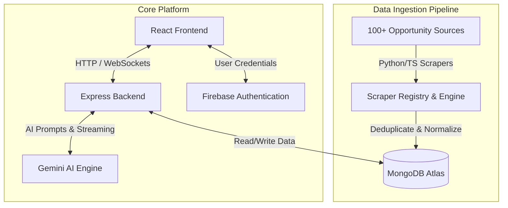

# YuvaHub – India's AI-Powered Student Opportunity Platform

<p align="center">
  
  
  
  
  
</p>

<p align="center">
  
  
  
  
  
  
  
</p>

---

## Table of Contents
- [Project Overview](#-project-overview)
- [Key Features](#-key-features)
- [Tech Stack](#%EF%B8%8F-tech-stack)
- [System Architecture & Flow](#-system-architecture--flow)
- [Local Development Setup](#%EF%B8%8F-local-development-setup)
- [Environment Variables Guide](#-environment-variables-guide)
- [Reference Guides](#-reference-guides)
- [Project Admin & Maintainer](#-project-admin--maintainer)
- [Contributing](#-contributing)
- [Contributors](#-contributors)

---

## Project Overview

Students in India currently search dozens of platforms daily—such as LinkedIn, Unstop, Internshala, Devpost, and government portals—to discover internships, scholarships, and hackathons. Because these opportunities are scattered and repetitive, the process is time-consuming and inefficient.

**YuvaHub** solves this by aggregating, normalizing, and personalizing student opportunities using Google's Gemini AI. The platform provides a tailored opportunity feed, an AI-powered resume review assistant, and dedicated hubs for career resources, allowing students to focus on growth rather than search.

---

## Key Features

- **AI-Ranked Home Feed:** Opportunity matching personalized to the student's profile, qualifications, and interests.
- **Unified Opportunity Explore:** Filters for remote/offline work, stipends, category (Jobs, Internships, Hackathons, Scholarships), and deadlines.
- **AI Career Assistant:** Includes a resume analyzer for ATS scores, cover letter generator, eligibility checks, and career mentoring powered by Google Gemini.
- **Dedicated Hubs:** Detailed sections for active scholarships, hackathon schedules, and freshers jobs.
- **Peer Community forums:** Post discussion threads, share study materials, and network with mentors.

---

## Tech Stack

YuvaHub is built on a high-performance stack:

| Component | Technologies |
| :--- | :--- |
| **Frontend** | React 19, Vite, Tailwind CSS v4, Lucide React, Motion |
| **Backend** | Express 5, Node.js, Socket.io |
| **Database**| MongoDB (Indexing & Aggregations), Firebase (Auth & metadata store) |
| **AI Integration** | Google Gemini API (`@google/genai` and `@google/generative-ai`) |

---

## System Architecture & Flow

The layout below highlights the data flow from scrapers to database ingestion, through the backend APIs, and finally onto the user's dashboard feed:



---

## Local Development Setup

To run YuvaHub locally on your machine, follow these instructions:

### 1. Prerequisites
Ensure you have **Node.js** (v18 or higher) and **npm** installed on your system.

### 2. Clone the Repository
```bash
git clone https://github.com/uditt490-pixel/YuvaHub.git
```

### 3. Install Dependencies
```bash
npm install
```

### 4. Configure Environment Variables
Create a `.env` file in the root directory (you can copy the structure from `.env.example`):
```bash
cp .env.example .env
```
Open the `.env` file and insert your credentials. See the [Environment Variables Guide](#-environment-variables-guide) below.

### 5. Configure Firebase Authentication (Google Sign-In Setup)
Firebase authentication credentials are loaded from `firebase-applet-config.json` in the root folder.
* **Option A (Use Shared Dev Config)**: If you use the repository's default file, ask the project administrator to add `localhost` to the Authorized Redirect Domains in the main Firebase Console.
* **Option B (Set Up Your Own Sandbox - Recommended)**:
  1. Create a free Firebase project at the [Firebase Console](https://console.firebase.google.com/).
  2. Register a Web App and replace the keys inside `firebase-applet-config.json` in your project root with your credentials.
  3. Go to **Authentication** -> **Sign-in method** in your Firebase console and enable **Google**.
  4. Go to **Authentication** -> **Settings** -> **Authorized domains** -> click **Add Domain** -> type `localhost` -> click **Add**.
  5. Prevent Git from tracking your private credentials by running:
     ```bash
     git update-index --assume-unchanged firebase-applet-config.json
     ```

### 6. Run the Project
To run the server in development mode with hot-reloading:
```bash
npm run dev
```
Open your browser and navigate to `http://localhost:5173`.

### 6. Additional Build & Run Scripts
- **Compile Production Build:** `npm run build`
- **Run Production Bundle:** `npm run start`
- **Manually Run Scrapers:** `npm run scrape`
- **Check Database Connectivity:** `npm run test-mongo`

### 7. Optional Docker & Redis Setup
Running Docker is **optional** for local development. `npm run dev` works out-of-the-box without Docker by running background tasks in local fallback mode.

If you wish to test BullMQ queues or Meilisearch indexing locally with Redis, ensure Docker Desktop is running and start the containers:
```bash
docker compose up -d
```

---

## Environment Variables Guide

Provide these keys in your `.env` file to fully enable application databases and AI APIs:

| Variable Name | Description | Source / Link |
| :--- | :--- | :--- |
| `MONGODB_URI` | Connection URI for the MongoDB Atlas Cluster. | MongoDB Atlas Dashboard |
| `MONGODB_DB_NAME` | Target database collection name. | `yuvahub` |
| `GEMINI_API_KEY` | Authentication key for Google Gemini model access. | [Google AI Studio](https://aistudio.google.com/) |
| `APP_URL` | Base host URL of the local or deployed server. | `http://localhost:3000` |
| `FRONTEND_URL` | Allowed client origin to enforce CORS security policy. | `http://localhost:5173` (or Vercel URL) |
| `VITE_EMAILJS_SERVICE_ID` | EmailJS service connection ID. | [EmailJS Dashboard](https://www.emailjs.com/) |
| `VITE_EMAILJS_TEMPLATE_ID`| EmailJS template container ID. | [EmailJS Dashboard](https://www.emailjs.com/) |
| `VITE_EMAILJS_PUBLIC_KEY` | Public client key for direct frontend transmission. | [EmailJS Dashboard](https://www.emailjs.com/) |

---

## Reference Guides

For details on advanced configuration, deploy strategies, and architectural designs, refer to the following:
* **Product Requirements:** [PRD.md](./docs/PRD.md)
* **Frontend Vercel Deployment:** [DEPLOYMENT.md](./docs/DEPLOYMENT.md)
* **Backend Render Deployment & Cron Scraper:** [RENDER_DEPLOYMENT_GUIDE.md](./docs/RENDER_DEPLOYMENT_GUIDE.md)
* **Domain Name Settings:** [DOMAIN_SETUP.md](./docs/DOMAIN_SETUP.md)

---

## Project Admin & Maintainer

The project is initiated and maintained by:

| Maintainer | GitHub Profile | Contact Email |
| :--- | :--- | :--- |
| **Udit** | [@uditt490-pixel](https://github.com/uditt490-pixel) | [uditt490@gmail.com](mailto:uditt490@gmail.com) |

---

## Contributing

We welcome contributions from developers! To start contributing:
1. **Fork** the repository on GitHub.
2. Create a new development **branch** for your issue:
   ```bash
   git checkout -b feature/amazing-feature
   ```
3. Implement your changes following clean coding practices.
4. **Commit** changes with clear messages:
   ```bash
   git commit -m "feat: add amazing new feature"
   ```
5. **Push** to the branch:
   ```bash
   git push origin feature/amazing-feature
   ```
6. Open a **Pull Request** (PR) detailing what issues your code resolves.

---

## Contributors

Thank you to everyone who has contributed to building YuvaHub! 

This list updates dynamically whenever a Pull Request is successfully merged:

<p align="center">
  <a href="https://github.com/uditt490-pixel/YuvaHub/graphs/contributors">
    
  </a>
</p>