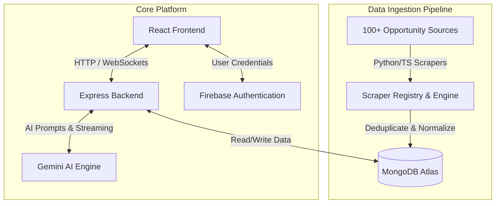

# YuvaHub – India's AI-Powered Student Opportunity Platform

<p align="center">
  
  
  
  
  
</p>

<p align="center">
  
  
  
  
  
  
  
</p>

---

## Table of Contents
- [Project Overview](#-project-overview)
- [Key Features](#-key-features)
- [Tech Stack](#%EF%B8%8F-tech-stack)
- [Project Structure](#-project-structure)
- [System Architecture & Flow](#-system-architecture--flow)
- [Local Development Setup](#%EF%B8%8F-local-development-setup)
- [Environment Variables Guide](#-environment-variables-guide)
- [Troubleshooting](#-troubleshooting)
- [Reference Guides](#-reference-guides)
- [Project Admin & Maintainer](#-project-admin--maintainer)
- [Contributing](#-contributing)
- [Contributors](#-contributors)

---

## Project Overview

Students in India currently search dozens of platforms daily—such as LinkedIn, Unstop, Internshala, Devpost, and government portals—to discover internships, scholarships, and hackathons. Because these opportunities are scattered and repetitive, the process is time-consuming and inefficient.

**YuvaHub** solves this by aggregating, normalizing, and personalizing student opportunities using Google's Gemini AI. The platform provides a tailored opportunity feed, an AI-powered resume review assistant, and dedicated hubs for career resources, allowing students to focus on growth rather than search.

---

## Key Features

- **AI-Ranked Home Feed:** Opportunity matching personalized to the student's profile, qualifications, and interests.
- **Unified Opportunity Explore:** Filters for remote/offline work, stipends, category (Jobs, Internships, Hackathons, Scholarships), and deadlines.
- **AI Career Assistant:** Includes a resume analyzer for ATS scores, cover letter generator, eligibility checks, and career mentoring powered by Google Gemini.
- **Dedicated Hubs:** Detailed sections for active scholarships, hackathon schedules, and freshers jobs.
- **Peer Community forums:** Post discussion threads, share study materials, and network with mentors.

## Resume Builder (Planned)

**Problem:** While YuvaHub can analyze existing resumes, many freshers don't even have a basic, ATS‑friendly resume to begin with.

**Why It's Needed:** A built‑in resume builder ensures users create high‑quality, standardized resumes that are optimized for both human recruiters and ATS software, directly from their YuvaHub profile data.

---

## Tech Stack

YuvaHub uses a modern full-stack architecture combining a React frontend, Node.js/Express backend services, MongoDB data storage, Firebase authentication, real-time communication, background workers, and Google Gemini AI integrations.

| Component | Technologies |
| :--- | :--- |
| **Frontend** | React 19, Vite, Tailwind CSS v4, Lucide React, Motion |
| **Backend** | Express 5, Node.js, Socket.io |
| **Database**| MongoDB (Indexing & Aggregations), Firebase (Auth & metadata store) |
| **AI Integration** | Google Gemini API (`@google/genai` and `@google/generative-ai`) |

## 📁 Project Structure

The repository is organized into separate areas for the frontend, backend services, data processing, documentation, and testing.

```text
YuvaHub/
├── .github/                 # GitHub Actions, issue templates, and PR configuration
├── .githooks/               # Git hooks for local development workflows
├── docs/                    # Architecture, deployment, API, and project documentation
├── firestore-tests/         # Firestore emulator and rules tests
├── functions/               # Firebase Cloud Functions
├── public/                  # Static assets and web application files
├── scripts/                 # Development and validation utility scripts
├── src/                     # Main application source code
│   ├── api/                 # API controllers, routes, middleware, and services
│   ├── components/          # Reusable React components
│   ├── config/              # Application and environment configuration
│   ├── consumers/           # Event and queue consumers
│   ├── context/             # React application contexts
│   ├── events/              # Event bus and event schemas
│   ├── hooks/               # Reusable React hooks
│   ├── lib/                 # Shared libraries and integrations
│   ├── models/              # Data models and schemas
│   ├── pages/               # Application pages
│   ├── queues/              # Background job queues
│   ├── routes/              # Application route definitions
│   ├── scrapers/            # Opportunity scraping and adapters
│   ├── services/            # Business logic and application services
│   ├── socket/              # WebSocket functionality
│   ├── types/               # Shared TypeScript types
│   ├── utils/               # Utility and helper functions
│   └── workers/             # Background workers
├── tests/                   # Unit, integration, and application tests
│   └── e2e/                 # Playwright end-to-end tests
├── .env.example             # Environment variable template
├── docker-compose.yml       # Optional Docker service configuration
├── package.json             # Dependencies and npm scripts
├── server.ts                # Backend server entry point
├── scrape-cli.ts            # Scraper command-line entry point
├── sync-all.ts              # Data synchronization utility
├── vite.config.ts           # Vite configuration
├── vitest.config.ts         # Vitest configuration
├── playwright.config.ts     # Playwright configuration
└── README.md                # Main project documentation
```

### Main Source Directories

* **`src/components/`** – Reusable UI components used throughout the application.
* **`src/pages/`** – Page-level React components for major application views.
* **`src/api/`** – API-related controllers, routes, middleware, services, and integrations.
* **`src/services/`** – Core application and business logic.
* **`src/models/`** – Data schemas and models used by the application.
* **`src/scrapers/`** – Opportunity scraping logic and scraper adapters.
* **`src/queues/`** – Background job queue definitions.
* **`src/workers/`** – Background workers that process asynchronous jobs.
* **`src/socket/`** – Real-time communication and WebSocket functionality.
* **`tests/`** – Automated unit and integration tests.
* **`tests/e2e/`** – Browser-based end-to-end tests using Playwright.
* **`docs/`** – Detailed documentation for architecture, deployment, APIs, configuration, and project requirements.

> **Note:** The repository structure may evolve as new features and services are added. Refer to the latest repository contents when navigating the project.


---

## System Architecture & Flow

The layout below highlights the data flow from scrapers to database ingestion, through the backend APIs, and finally onto the user's dashboard feed:


```mermaid
graph TD
    subgraph Data Ingestion Pipeline
        Sources[100+ Opportunity Sources] -->|Python/TS Scrapers| Scrapers[Scraper Registry & Engine]
        Scrapers -->|Deduplicate & Normalize| DB[(MongoDB Atlas)]
    end

    subgraph Core Platform
        Frontend[React Frontend] <-->|HTTP / WebSockets| Backend[Express Backend]
        Frontend <-->|User Credentials| FirebaseAuth[Firebase Authentication]
        Backend <-->|Read/Write Data| DB
        Backend <-->|AI Prompts & Streaming| Gemini[Gemini AI Engine]
    end
```

---

## Local Development Setup

To run YuvaHub locally on your machine, follow these instructions:

### 1. Prerequisites
Ensure you have **Node.js** (v18 or higher) and **npm** installed on your system.

### 2. Clone the Repository
```bash
git clone https://github.com/uditt490-pixel/YuvaHub.git
```

### 3. Install Dependencies
```bash
npm install
```

### 4. Configure Environment Variables
Create a `.env` file in the root directory (you can copy the structure from `.env.example`):
```bash
cp .env.example .env
```
Open the `.env` file and insert your credentials. See the [Environment Variables Guide](#-environment-variables-guide) below.

### 5. Configure Firebase Authentication (Google Sign-In Setup)
Firebase authentication credentials are loaded from `firebase-applet-config.json` in the root folder.
* **Option A (Use Shared Dev Config)**: If you use the repository's default file, ask the project administrator to add `localhost` to the Authorized Redirect Domains in the main Firebase Console.
* **Option B (Set Up Your Own Sandbox - Recommended)**:
  1. Create a free Firebase project at the [Firebase Console](https://console.firebase.google.com/).
  2. Register a Web App and replace the keys inside `firebase-applet-config.json` in your project root with your credentials.
  3. Go to **Authentication** -> **Sign-in method** in your Firebase console and enable **Google**.
  4. Go to **Authentication** -> **Settings** -> **Authorized domains** -> click **Add Domain** -> type `localhost` -> click **Add**.
  5. Prevent Git from tracking your private credentials by running:
     ```bash
     git update-index --assume-unchanged firebase-applet-config.json
     ```

### 6. Run the Project
To run the server in development mode with hot-reloading:
```bash
npm run dev
```
Open your browser and navigate to `http://localhost:5173`.

### 7. Additional Build & Run Scripts
- **Compile Production Build:** `npm run build`
- **Run Production Bundle:** `npm run start`
- **Manually Run Scrapers:** `npm run scrape`
- **Check Database Connectivity:** `npm run test-mongo`

### 8. Running Tests
YuvaHub separates unit/integration tests from end-to-end (e2e) tests:
- **Unit & Integration Tests (Vitest):** Runs standard backend and controller validation tests:
  ```bash
  npm test
  ```
- **End-to-End Tests (Playwright):** Runs browser automation and frontend flow tests:
  ```bash
  npm run test:e2e
  ```

### 9. Optional Docker & Redis Setup
Running Docker is **optional** for local development. `npm run dev` works out-of-the-box without Docker by running background tasks in local fallback mode.

If you wish to test BullMQ queues or Meilisearch indexing locally with Redis, ensure Docker Desktop is running and start the containers:
```bash
docker compose up -d
```
---

## Environment Variables Guide

Copy the reviewed template:

```bash
cp .env.example .env
```

The template classifies variables as required, conditional, optional,
development-only, public, or secret. Values prefixed with `VITE_` are bundled
into browser assets and must never contain server credentials.

Startup validation currently requires:

```text
MONGODB_URI
JWT_SECRET
GEMINI_API_KEY
```

`REDIS_URL` is additionally required when Redis is explicitly enabled.

See the complete guide for supported integrations, safe secret handling,
split MongoDB connections, workers, Firebase, SMTP, Sentry, dynamic scraper
URLs, and deployment guidance:

- [Environment variables guide](./docs/ENVIRONMENT_VARIABLES.md)
- [Environment template](./.env.example)

---

## 🛠️ Troubleshooting

### `npm install` Fails

Verify that Node.js and npm are installed:

```bash
node --version
npm --version
```

Then try installing the dependencies again:

```bash
npm install
```

If the dependency tree is corrupted, remove `node_modules` and reinstall the dependencies.

> On Windows, remove the `node_modules` directory manually or use the appropriate PowerShell command.

### Environment Variable Errors

If the application reports missing environment variables:

1. Make sure a `.env` file exists in the project root.
2. Compare it with `.env.example`.
3. Verify the required variables are configured.
4. Restart the development server after changing environment variables.

The required startup variables currently include:

```text
MONGODB_URI
JWT_SECRET
GEMINI_API_KEY
```

`REDIS_URL` is additionally required when Redis is explicitly enabled.

For the complete configuration reference, see the [Environment Variables Guide](./docs/ENVIRONMENT_VARIABLES.md).

### MongoDB Connection Problems

If YuvaHub cannot connect to MongoDB:

* Verify that `MONGODB_URI` is correct.
* Check that the MongoDB instance or MongoDB Atlas cluster is available.
* If using MongoDB Atlas, verify that the required network access rules are configured.
* Run the database connectivity check:

```bash
npm run test-mongo
```

### Firebase Authentication Problems

If Google Sign-In does not work during local development:

* Verify that Google authentication is enabled in Firebase.
* Check the Firebase configuration used by the application.
* Make sure `localhost` is included in the authorized domains.
* Restart the development server after changing Firebase configuration.

### Development Server Does Not Start

Run the development server with:

```bash
npm run dev
```

If the configured port is already in use, stop the process using that port and start the development server again.

The default development URL is:

```text
http://localhost:5173
```

### Docker / Redis Problems

Docker is optional for the standard development workflow.

If you need Redis-backed services locally, make sure Docker Desktop is running and start the containers:

```bash
docker compose up -d
```

If Docker is not required for your workflow, you can continue using the local fallback mode.

### Test Failures

For unit and integration tests, run:

```bash
npm test
```

For end-to-end tests, run:

```bash
npm run test:e2e
```

If a test fails, check the terminal output first and verify that the required environment variables and services are configured.

### Before Opening an Issue

Before reporting a setup or documentation problem:

1. Check the relevant files in the `docs/` directory.
2. Compare your environment with `.env.example`.
3. Verify your Node.js and npm versions.
4. Reproduce the issue from a clean development setup when possible.
5. Include the relevant error message and steps to reproduce when opening an issue.

---

## Reference Guides

For details on advanced configuration, deploy strategies, and architectural designs, refer to the following:
* **Product Requirements:** [PRD.md](./docs/PRD.md)
* **Frontend Vercel Deployment:** [DEPLOYMENT.md](./docs/DEPLOYMENT.md)
* **Backend Render Deployment & Cron Scraper:** [RENDER_DEPLOYMENT_GUIDE.md](./docs/RENDER_DEPLOYMENT_GUIDE.md)
* **Domain Name Settings:** [DOMAIN_SETUP.md](./docs/DOMAIN_SETUP.md)
* **API Versioning & Deprecation Policy:** [API_VERSIONING.md](./docs/API_VERSIONING.md)

---

## Project Admin & Maintainer

The project is initiated and maintained by:

| Maintainer | GitHub Profile | Contact Email |
| :--- | :--- | :--- |
| **Udit** | [@uditt490-pixel](https://github.com/uditt490-pixel) | [uditt490@gmail.com](mailto:uditt490@gmail.com) |

---

## Contributing

We welcome contributions from developers! To start contributing:
1. **Fork** the repository on GitHub.
2. Create a new development **branch** for your issue:
   ```bash
   git checkout -b feature/amazing-feature
   ```
3. Implement your changes following clean coding practices.
4. **Commit** changes with clear messages:
   ```bash
   git commit -m "feat: add amazing new feature"
   ```
5. **Push** to the branch:
   ```bash
   git push origin feature/amazing-feature
   ```
6. Open a **Pull Request** (PR) detailing what issues your code resolves.

---

## Contributors

Thank you to everyone who has contributed to building YuvaHub! 

This list updates dynamically whenever a Pull Request is successfully merged:

<p align="center">
  <a href="https://github.com/uditt490-pixel/YuvaHub/graphs/contributors">
    
  </a>
</p>